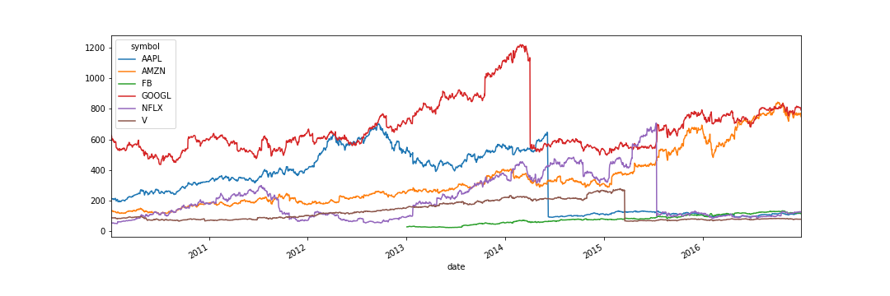
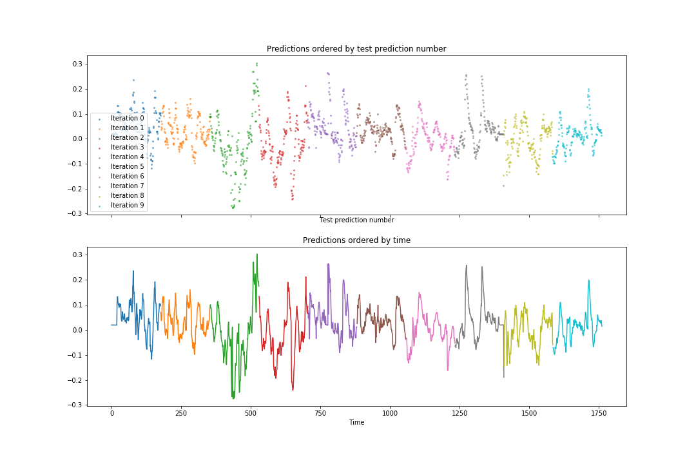

# Predicting stock market prices

__Data manipulation, feature extraction, prediction and cross-validation of stock market prices time series.__ 

Full analysis of time series manipulation and predictions using data from historical stock market prices.

___
### COVID19_notebook.ipynb

Along the notebook, we
1. Load, transform and clean the data.
2. Engineer statistical and time-lagged features.
3. Fit and predict regression models.
4. Perform K-fold and TimeSeriesSplit cross-validation.
5. Study the stability of the model's coefficients and of its predictive power across CV splits.